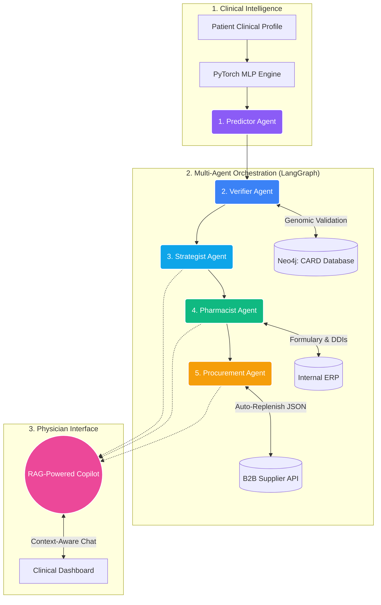

# 🧬 Sentinel-GNN  
**Autonomous Clinical & Supply Chain ERP via Multi-Agent Orchestration**

Sentinel-GNN is an end-to-end medical intelligence platform that bridges the dangerous gap between clinical decision support and hospital logistics. By orchestrating a pipeline of 5 specialized AI Agents via LangGraph, Sentinel doesn't just predict Antimicrobial Resistance (AMR)—it autonomously formulates therapies, audits hospital formularies, and executes B2B supply chain restocks to ensure life-saving drugs are always available.

---

## 🏗️ System Architecture



---

## 🚀 The 5-Agent Pipeline

Sentinel operates using a strictly defined, self-healing LangGraph pipeline where each agent possesses a specific enterprise role:

- 🧠 **Predictor Agent (PyTorch MLP)**  
  Ingests patient metadata (Age, Hospitalization History, Comorbidities) and runs a forward pass through a custom Multilayer Perceptron to classify the probability of antibiotic resistance (e.g., Ciprofloxacin resistance).

- 🧬 **Verifier Agent (Knowledge Graph)**  
  Cross-references the MLP’s prediction against a Neo4j graph database of the CARD genomic registry. Grounds predictions in verifiable biological mechanisms (e.g., CpxR efflux pumps), reducing hallucinations.

- ⚕️ **Strategist Agent (Clinical Logic)**  
  Synthesizes verified predictions with patient constraints (e.g., allergies, renal impairment) to recommend safe, risk-adjusted therapies.

- 💊 **Pharmacist Agent (Safety & Cost)**  
  Audits recommendations against the hospital formulary. Flags Drug-Drug Interactions (DDIs), checks approval requirements, and calculates costs.

- 📦 **Procurement Agent (Autonomous ERP)**  
  Monitors inventory levels and triggers automated B2B purchase orders via API when stock falls below thresholds.

---

## 💬 Context-Aware AI Copilot (RAG Pipeline)

Sentinel includes a Retrieval-Augmented Generation (RAG) Copilot embedded in the clinical dashboard.

It automatically ingests:
- Patient profile (age, allergies, vitals)
- Predicted resistance risk
- Recommended therapy
- Real-time pharmacy inventory

Physicians can:
- Validate recommendations
- Adjust dosages dynamically
- Explore alternative treatments

All responses are grounded in the patient’s real-time digital context.

---

## 🛠️ Tech Stack

| Layer             | Technologies Used                              |
|-------------------|------------------------------------------------|
| Predictive ML     | PyTorch (MLP), Pandas, Scikit-Learn (SMOTE)    |
| Agentic AI        | LangGraph, LangChain, OpenAI / Groq APIs       |
| Knowledge Base    | Neo4j (Graph DB), RAG Vector Embeddings        |
| Backend & API     | FastAPI, Pydantic, Python 3.10+                |
| Frontend          | Next.js 14, React, Tailwind CSS, Lucide Icons  |

---

## 💾 Installation & Setup

### 1. Backend Initialization

```bash
cd backend
python -m venv venv

# Activate environment
source venv/bin/activate   # Windows: venv\Scripts\activate

# Install dependencies and run server
pip install -r requirements.txt
uvicorn main:app --reload
```

---

### 2. Frontend Initialization

```bash
cd frontend
npm install
npm run dev
```

App runs at: **http://localhost:3000**

---

## 🤝 The Team

Built with 💻 and ☕ by **The Found Tokens**  
**Hridesh • Apoorva**  

Developed for the **AI Hackathon Spirit26 at IIT BHU**
