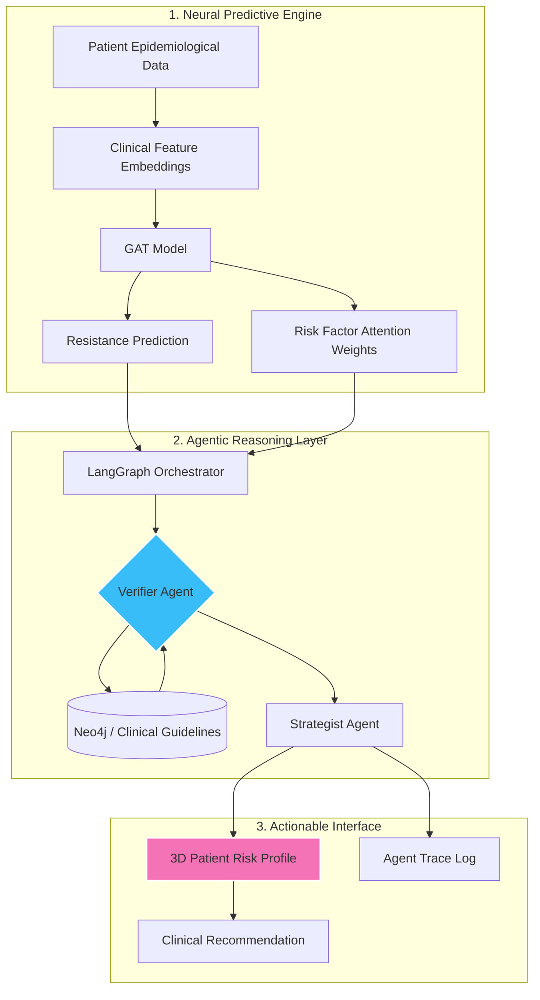
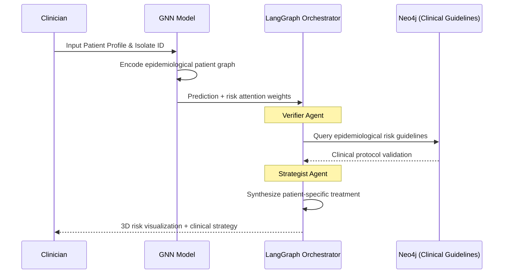

# 🧬 Sentinel-GNN

### *Explainable Antimicrobial Resistance (AMR) Prediction via Epidemiological Neural-Symbolic Intelligence*

[](https://github.com/CodeR-6-9/Sentinel_GNN)
[](#)

**Sentinel-GNN** is a medical intelligence platform designed to address the **"black-box" limitation in public health and antimicrobial resistance prediction**.

By shifting from isolated molecular analysis to an **Epidemiological Patient Graph**, Sentinel-GNN combines **Graph Attention Networks (GATs)** with **agentic reasoning (LangGraph)** to produce predictions that are:

* **Accurate** (driven by patient metadata and strain networks)  
* **Clinically Grounded** (verified against epidemiological guidelines)  
* **Visually Interpretable** (3D risk-factor explainability)  

---

## 🏗️ System Architecture

Sentinel-GNN follows a **neural-symbolic hybrid architecture**, integrating deep learning on patient populations with structured clinical knowledge.



---

## 🔄 Execution Flow

Instead of a single forward pass, Sentinel-GNN operates as a multi-stage clinical reasoning pipeline:



---

## 🚀 Key Innovations

### 1. Epidemiological Verification Layer (Graph-RAG)
Most AMR models evaluate bacteria in a vacuum, ignoring the host.

The Verifier Agent uses Graph Retrieval-Augmented Generation (Graph-RAG) to validate the GAT's highlighted patient risk factors (e.g., Diabetes, Previous Hospitalization) against established clinical protocols (CDC/WHO).

- Confirms known epidemiological resistance trends  
- Flags inconsistencies between model output and clinical evidence  
- Surfaces high-risk patient demographics for specific outbreaks  

---

### 2. 3D Explainability via Patient Risk Attention
We project GAT attention weights onto a 3D patient-centric interaction space using Three.js.

- High-impact patient risk factors (Age, Gender, Comorbidities) are visually highlighted in pulsing pink  
- Enables intuitive inspection of why the AI predicted resistance  
- Bridges mathematical model interpretability with rapid clinician usability  

---

### 3. Context-Aware Clinical Strategy Engine
The Strategist Agent treats the patient, not just the bug.

- Evaluates the confidence of the GNN alongside verified clinical constraints  
- Suggests alternative therapy strategies tailored to the patient's specific risk profile (e.g., avoiding nephrotoxic drugs in elderly diabetic patients)  
- Promotes effective antimicrobial stewardship  

---

## 🛠️ Tech Stack

### Core Intelligence
- PyTorch Geometric (Graph Attention Networks)  
- LangGraph (Agentic orchestration)  
- Scikit-Learn (Feature engineering pipeline)  

### Knowledge Layer
- Neo4j (Graph database)  
- Public Health & Clinical Guidelines (CDC/WHO structural logic)  

### Backend
- FastAPI  
- Pydantic  
- Python 3.10+  

### Frontend
- Next.js 14  
- React Three Fiber (Three.js)  
- Tailwind CSS  

---

## 💾 Installation & Setup

### Backend
```bash
cd backend
python -m venv venv
source venv/bin/activate  # Windows: venv\Scripts\activate
pip install -r requirements.txt
uvicorn app.api.server:app --reload
```

### Frontend
```bash
cd frontend
npm install
npm run dev
```

---

## 🤝 Team

**Hridesh & Apoorva — The Found Tokens**  
Developed for *AI Hackathon Spirit26, IIT BHU*
