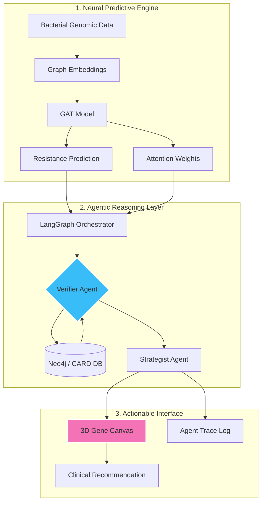
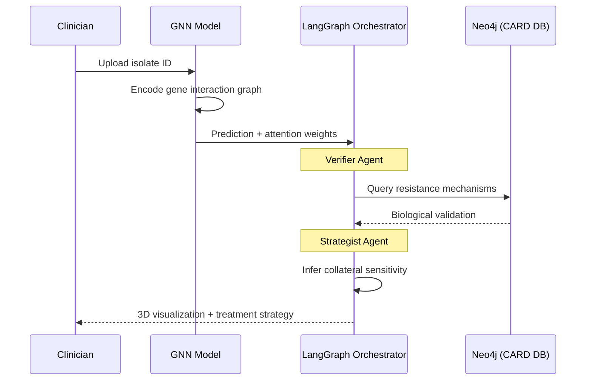

# 🧬 Sentinel-GNN

### *Explainable Antibiotic Resistance Discovery via Neural-Symbolic Intelligence*

[](https://github.com/CodeR-6-9/Sentinel_GNN)
[](#)

**Sentinel-GNN** is a medical intelligence platform designed to address the **"black-box" limitation in antimicrobial resistance (AMR) prediction**.

By combining **Graph Attention Networks (GATs)** with **agentic reasoning (LangGraph)**, the system produces predictions that are:

* **Accurate** (data-driven)
* **Biologically grounded** (knowledge-verified)
* **Visually interpretable** (3D explainability)

---

## 🏗️ System Architecture

Sentinel-GNN follows a **neural-symbolic hybrid architecture**, integrating deep learning with structured biological knowledge.



---

## 🔄 Execution Flow

Instead of a single forward pass, Sentinel-GNN operates as a **multi-stage reasoning pipeline**:



---

## 🚀 Key Innovations

### 1. Biological Verification Layer (Graph-RAG)

Most AMR models lack **biological grounding**.

The **Verifier Agent** uses **Graph Retrieval-Augmented Generation (Graph-RAG)** to validate predictions against the **Comprehensive Antibiotic Resistance Database (CARD)**.

* Confirms known resistance pathways
* Flags inconsistencies between model output and biological evidence
* Surfaces **potential novel resistance mechanisms**

---

### 2. 3D Explainability via Attention Mapping

We project **GAT attention weights** onto a **3D genomic interaction space** using **Three.js**.

* High-impact genes are visually highlighted
* Enables **intuitive inspection of resistance drivers**
* Bridges model interpretability with clinician usability

---

### 3. Collateral Sensitivity Strategy Engine

The **Strategist Agent** identifies **evolutionary trade-offs** in bacterial resistance.

* Detects vulnerabilities induced by resistance mutations
* Suggests **sequential therapy strategies**
* Enables exploitation of **collateral sensitivity networks**

---

## 🛠️ Tech Stack

**Core Intelligence**

* PyTorch Geometric (Graph Attention Networks)
* LangGraph (Agentic orchestration)

**Knowledge Layer**

* Neo4j (Graph database)
* CARD (Antibiotic resistance database)

**Backend**

* FastAPI
* Pydantic
* Python 3.10+

**Frontend**

* Next.js 14
* React Three Fiber (Three.js)
* Tailwind CSS

---

## 💾 Installation & Setup

### Backend

```bash
cd backend
python -m venv venv
source venv/bin/activate  # Windows: venv\Scripts\activate
pip install -r requirements.txt
uvicorn app.api.server:app --reload
```

### Frontend

```bash
cd frontend
npm install
npm run dev
```

---

## 🤝 Team

**Hridesh & Apoorva — The Found Tokens**
Developed for *AI Hackathon Spirit26, IIT BHU*

---

